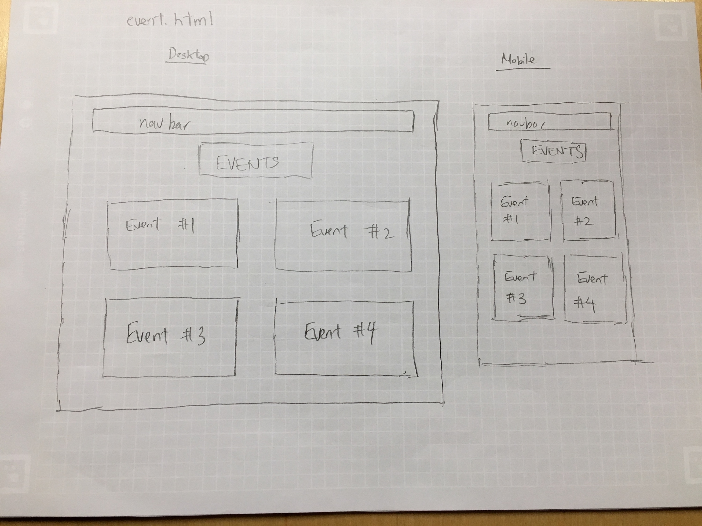
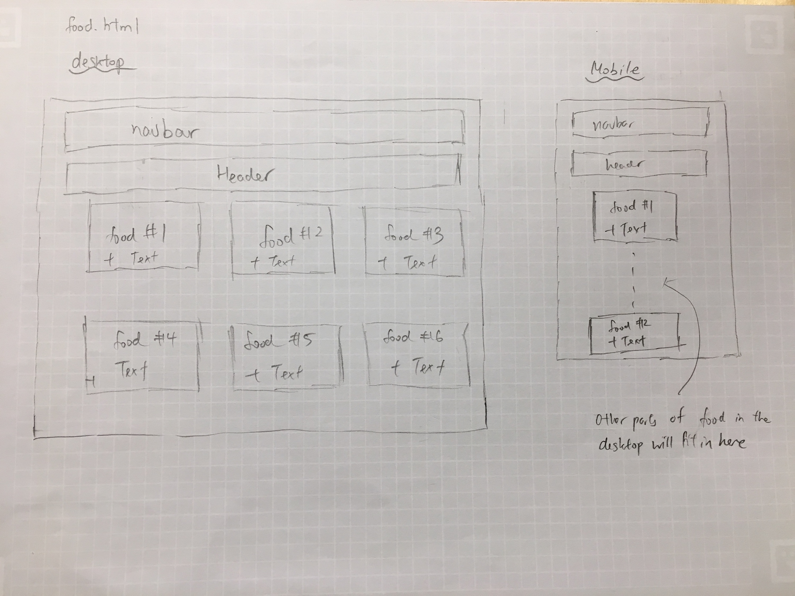
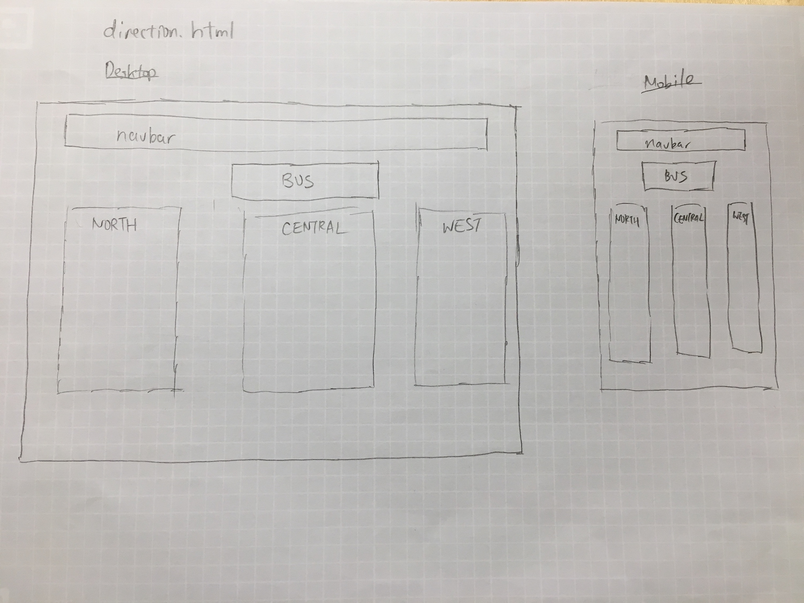
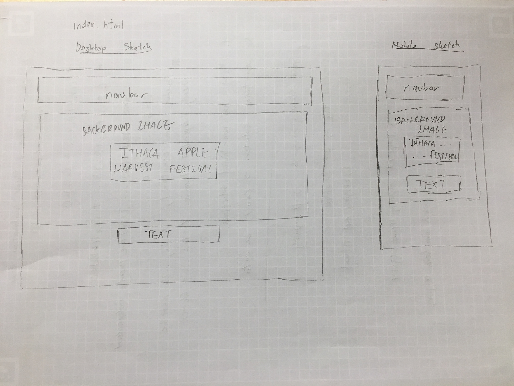
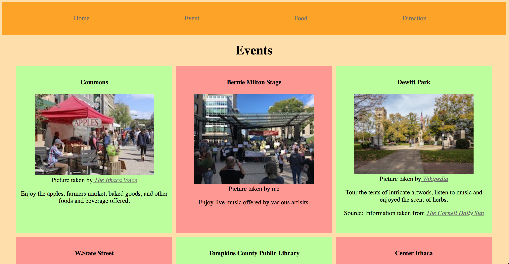
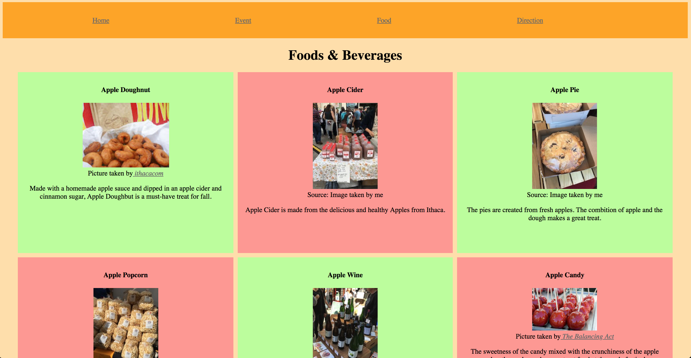
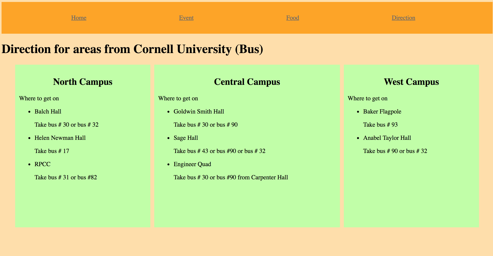

# Project 2 - Design Journey

**For each milestone, complete only the sections that are labeled with that milestone.**

Be clear and concise in your writing. Bullets points are acceptable.

## Milestone 1

### Target Audience (Milestone 1)
[In this part, write down who your target audience is.]

My target audience are visitors from Cornell University. The target audience will be students, mainly freshman and sophomore, who have never visited the Apple Festival before. They are students who have heard about the event but never participated. I have chosen such target audience because there is a higher chance that the students have not visited the Apple Harvest Festival before.

### Persona (Milestone 1)
[In this part, create a persona that can represent your target audience, and describe him or her in details below.]

James Smith, a 18 year old student student just entering Cornell University, plans on visiting the Apple Festival with his friends. Although he has not visited outside of the campus before, he is very excited to have an opportunity to participate in the festival. He found about the festival on a brochure that was handed out at Campus.

James is a student in the hotel school who has very strong interest in culinary. He is a very ambitious student wanting to learn the culinary behind the festival in detail but also wants to enjoy his time with his friends. James is also the type of person who wants to visit every part of the festival. Not only is he interested in the food, he is curious about the events that are held during the event. He hopes to spend a good few hours during for the Apple Harvest festival. During his free time he likes to cook, listen to music and tour during his free time.

### Needs (Milestone 1)
[Collect your target audience's needs and wants for the website and list them one by one. Come up with several appropriate design ideas on how those needs may be met. In the **Memo** field, justify your ideas and add any additional comments you have. There is no specific number of needs required for this, but you need enough to do the job. See the example design journey for an example of how you might do this.]

Format:
- Need/Want #1
  - **Needs and Wants** (What does your client and audience need and want?)
    - Wants to visit the festival but does not know how to get there.
  - **Design Ideas and Choices** (How will you meet those needs and wants?)
    - Create a page specifically for directions. The page will consist of directions for mainly buses because cars can use navigations. There will be a direction for north, west, central campus.
    - Include maps and pictures so that the users can easily find the direction to the event.
  - **Memo** (Justify your decisions; additional notes.)
    - Having a page for direction can direct the users easily to the event. The page would also be easier to find.

- Need/Want #2
- **Needs and Wants** (What does your client and audience need and want?)
  - Wants to plan so that everyone can visit.
- **Design Ideas and Choices** (How will you meet those needs and wants?)
  - Create a page that with all events held and the time those events are held.
  - Add pictures of events so that users can decide what event they want to attend.
- **Memo** (Justify your decisions; additional notes.)
  - Creating a easily navigated page can let the target audience to easily plan their visit.

- Need/Want #3
- **Needs and Wants** (What does your client and audience need and want?)
  - Wants to know what kind of food are sold at the festival.
- **Design Ideas and Choices** (How will you meet those needs and wants?)
  - Create a food page.
  - Add pictures of food with reviews by visitors of the festival.
- **Memo** (Justify your decisions; additional notes.)
  - Can advertise the an crucial part of the festival and encourage more people to visit.
  - Web visitors can easily understand the option of food that is offered at the festival.

  Need/Want #4
  - **Needs and Wants** (What does your client and audience need and want?)
    - Wants to know the events and performances held at the festival
  - **Design Ideas and Choices** (How will you meet those needs and wants?)
    - Create a page for events/performances and create section dedicated for each events held at the festival.
  - **Memo** (Justify your decisions; additional notes.)
    - Easier for the users to find the events they want to attend. Diving the page into sections will make the page more visually attractive.

### Sketches / Screenshots / Storyboards (Milestone 1)
[In this part, include the sketches for each of your pages (both desktop and mobile versions). These sketches **must** be done on paper.]

### Additional Design Justifications (Milestone 1)
[If you feel like you haven’t fully explained your design choices, or you want to explain some functions in your site (e.g., if you feel like you make a special design choice which might not meet P2M1 requirement), you can use the additional design justifications to justify your design choices. Remember, this is place for you to justify your design choices which you haven’t covered in Milestone 1. Use it wisely. However, you don’t need to fill out this section if you think all design choices have been well explained in the design journey for Milestone 1.]

---

## Milestone 2

### Task Planning (Milestone 2)
[Plan out your four tasks for Milestone 2 here before doing your user testing]

1. Find how to get to the Apple Festival from North Campus.

2. Find what types of food are sold at the festival.

3. Find when the festival open/closes.

4. Find the events that are held at the festival.

### User 1 (Milestone 2)
[In this part, describe your user 1 by answering the questions below.]

1. Who is your user 1, e.g., where user 1 comes from, what is your user 1’s job, characteristics, etc.?

The first user is a student at Cornell University and, therefore, user 1's job is a student. User 1 is a student at the college of Engineering has never visited the Apple Festival before. The user used to live at New York before coming to Cornell.

2. Does your user 1 belong to your target audience of the site? (Yes / No)
The first user does belong to my target audience because the user is a freshman who has never visited the Apple Harvest Festival before.

[If “No”, what’s your strategy of associating the user test results to your target audience’s needs and wants? How can your re-design choices based on the user tests make a better fit for the target audience?]

### Tasks for User 1 (Milestone 2)
[Report the results for your user's performance on each of your four tasks. You should **describe the task** you ask the user to complete, explain **what the user did**, describe the user's **reaction/feedback** to the design, **reflect on the user's performance**, determine what **re-design choices** you will make. You can also add any additional comments in the **memo** field. See the example design journey for an example of what this would look like.]

Format:
- Task #1
  - **Task Description** (What was the task for this user?)
    - Find how to get to the Apple Festival from North Campus.
  - **How did the user do? Did that meet your expectation?**
    - The user was able to find the information easily.
    - It only took her a short time to find the necessary information. This was what I expected from the user.
  - **User’s reaction / feedback to the design** (e.g., specific problems or issues found in the tasks)
    - The user was satisfied with the amount of information provided about the ways to get to the apple festival from north campus.
  - **Your reflections about the user’s performance to the task**
    - The user was able to find the information in a relatively short time meaning that the task was completed well.
  - **Re-design choices**
    - From user 1's feedbacks, I do not feel the need to re-design the website.
  - **Memo** (Justify your decisions; additional notes.)
    - N/A

- Task #2
  - **Task Description** (What was the task for this user?)
    - Find what types of food are sold at the festival.
  - **How did the user do? Did that meet your expectation?**
    - The user was able to find the information with ease.
    - The user spent around 10 seconds finding the necessary information.
  - **User’s reaction / feedback to the design** (e.g., specific problems or issues found in the tasks)
    - From this user, I did not find any problems or issues that will make it hard for the users to find information.
  - **Your reflections about the user’s performance to the task**
    - The user did well and found the information in a short amount of time.
  - **Re-design choices**
    - In terms of layout and how the information is organized, re-design of the page seems unnecessary from the user's feedback.
  - **Memo** (Justify your decisions; additional notes.)
    - N/A

- Task #3
  - **Task Description** (What was the task for this user?)
    - Find when the festival open/closes.
  - **How did the user do? Did that meet your expectation?**
    - The user struggled to find this information as the user was confused on whether I was referring to the date or the time which the festival opens.
    - This did not meet my expectation because I thought that the user will be confused to find the information.
  - **User’s reaction / feedback to the design** (e.g., specific problems or issues found in the tasks)
    - The user told me that it would be better if I added the times in which the festival will open.
  - **Your reflections about the user’s performance to the task**
    - Although the user was able to find the information easily, the information provided on my website may have not been the information the user wanted.
  - **Re-design choices**
    - I will add a section that indicates the time which the apple harvest festival opens, for example, from 9AM to 6PM.
  - **Memo** (Justify your decisions; additional notes.)
    - N/A

- Task #4
  - **Task Description** (What was the task for this user?)
    - Find the events that are held at the festival.
  - **How did the user do? Did that meet your expectation?**
    - The user was able to find the information with relative ease.
    - This is what I expected as well.
  - **User’s reaction / feedback to the design** (e.g., specific problems or issues found in the tasks)
    - There were no major issues that was apparent from the user's reaction.
  - **Your reflections about the user’s performance to the task**
    - The user was able to complete the task without any problem.
  - **Re-design choices**
    - Re-design seems unnecessary from the user's feedback.
  - **Memo** (Justify your decisions; additional notes.)
    - N/A

### User 2 (Milestone 2)
[In this part, describe your user 2 by answering the questions below.]

1. Who is your user 2, e.g., where user 2 comes from, what is your user 2’s job, characteristics, etc.?

User 2 is also a student from Cornell University. User 2 is a freshman from the college of Art & Science and is currently studying computer science and economics. User 2 has never visited the apple festival but
is thinking about going next year. Before coming to Cornell University, user 2 lived in Shanghai, China.

2. Does your user 2 belong to your target audience of the site? (Yes / No)
Yes, user 2 does belong to my target audience.

[If “No”, what’s your strategy of associating the user test results to your target audience’s needs and wants? How can your re-design choices based on the user tests make a better fit for the target audience?]

### Tasks for User 2 (Milestone 2)
[Report the results for your user's performance on each of your four tasks. You should **describe the task** you ask the user to complete, explain **what the user did**, describe the user's **reaction/feedback** to the design, **reflect on the user's performance**, determine what **re-design choices** you will make. You can also add any additional comments in the **memo** field. See the example design journey for an example of what this would look like.]

Format:
- Task #1
  - **Task Description** (What was the task for this user?)
    - Find how to get to the Apple Festival from North Campus.
  - **How did the user do? Did that meet your expectation?**
    - The user was able to complete the task.
    - The user did meet my expectation as user 1 was able to find the information as well.
  - **User’s reaction / feedback to the design** (e.g., specific problems or issues found in the tasks)
    - The user found it relatively easy to find the necessary information.
  - **Your reflections about the user’s performance to the task**
    - The user was able to find complete the task without any serious issue.
  - **Re-design choices**
    - Redesigning of the formatting seems unnecessary because the user did not have trouble completing the task.
  - **Memo** (Justify your decisions; additional notes.)
    - N/A

- Task #2
  - **Task Description** (What was the task for this user?)
    - Find what types of food are sold at the festival.
  - **How did the user do? Did that meet your expectation?**
    - Similar to user 1, user 2 did not have trouble finding the information which matched with my expectations.
  - **User’s reaction / feedback to the design** (e.g., specific problems or issues found in the tasks)
    - In terms of formatting, User 2 told me that the layout allowed the user to easily find information.
  - **Your reflections about the user’s performance to the task**
    - The user performed well when completing the task.
  - **Re-design choices**
    - From user 2's performance, redesigning the page seems unnecessary in terms of formatting.
  - **Memo** (Justify your decisions; additional notes.)
    - N/A

- Task #3
  - **Task Description** (What was the task for this user?)
    - Find when the festival open/closes.
  - **How did the user do? Did that meet your expectation?**
    - The user had no problem finding the Information.
    - This did not meet my expectation as User 1 was struggling to find the specific time the festival was open.
    -Perhaps user 2 was thinking about the days which the festival was held when user 1 was thinking about the time.
  - **User’s reaction / feedback to the design** (e.g., specific problems or issues found in the tasks)
    - Major issues or specific problem seems nonexistent from User 2's reaction.
  - **Your reflections about the user’s performance to the task**
    - User 2 found the information quickly.
  - **Re-design choices**
    - Although the user did not struggle to find information, adding information about what time the festival seems like a useful information to many.
  - **Memo** (Justify your decisions; additional notes.)
    - N/A

- Task #4
  - **Task Description** (What was the task for this user?)
    - Find the events that are held at the festival.
  - **How did the user do? Did that meet your expectation?**
    - The user was able to find the information with ease.
    - User's performance met my expectation.
  - **User’s reaction / feedback to the design** (e.g., specific problems or issues found in the tasks)
    - The user found the box model to be a easy way to find information.
  - **Your reflections about the user’s performance to the task**
    - User performed well as the user was able to find information in a short amount of time.
  - **Re-design choices**
    - Redesigning of the page seems unnecessary in terms of formatting.
  - **Memo** (Justify your decisions; additional notes.)
    - N/A

### Additional Design Justifications (Milestone 2)
[If you feel like you haven’t fully explained your design choices in the design journey for Milestone 2, or you want to explain some functions in your site (e.g., if you feel like you make a special design choice which might not meet P2M2 requirement), you can use the additional design justifications to justify your design choices. Remember, this is place for you to justify your design choices which you haven’t covered in Milestone 2. Use it wisely. However, you don’t need to fill out this section if you think all design choices have been well explained in the design journey for Milestone 2.]

For my website I decided to create a CSS file for every page because I thought fixing the code will be easier when redesigning my website. Furthermore, creating separate CSS files allows more flexibility because changing the design will not affect other pages.

Screenshots

---

## Final Submission

### Task Planning (Final Submission)
[Plan out your four tasks for the Final Submission here before doing your user testing. These should probably be the same as your tasks from Milestone 2, unless you are changing them to address problems with your tasks that you discovered in the first user test.]

1. You are a freshman and decide to meet up with your friends at North campus to go to the apple harvest festival. You are your friend want to take the bus to the festival and decide to look at the website to figure out how to get there.

2. As you are walking with your friends around the festival, you feel hungry and want to buy some food. You look at the website to figure what types of food are sold at the Apple Harvest Festival.

3. You want to visit the festival as soon as it opens. You search on the website when the festival begins.

4. You finish eating your food and want to do something at the festival. You open the website to find which event you and your friends can participate.

### User 3 (Final Submission)
[In this part, describe your user 3 by answering the questions below.]

1. Who is your user 3, e.g., where user 3 comes from, what is your user 3’s job, characteristics, etc.?

User 3 is a sophomore student in the Hotel administration school and has never visited the Apple Harvest Festival before. User 3 comes from Japan where apples are apples are eaten very often; therefore, user 3 is very excited to attend the event. Since user 3 is learning culinary for classes, user 3 also has a strong interest in how apples are used to create food.

2. Does your user 3 belong to your target audience of the site? (Yes / No)
Yes

[If “No”, what’s your strategy of associating the user test results to your target audience’s needs and wants? How can your re-design choices based on the user tests make a better fit for the target audience?]

### Tasks for User 3 (Final Submission)
[Report the results for your user's performance on each of your tasks. You should **describe the task** you ask the user to complete, explain **what the user did**, describe the user's **reaction/feedback** to the design, **reflect on the user's performance**, determine what **re-design choices** you will make. You can also add any additional comments in the **memo** field. See the example design journey for an example of what this would look like.]

Format:
- Task #1
  - **Task Description** (What was the task for this user?)
    - The task was to figure out the direction to the Apple Harvest Festival from North Campus of Cornell University.
  - **How did the user do? Did that meet your expectation?**
    - The user was able to find the necessary information in a short amount of time.
    - This did meet my expectation because user 1 and user 2 was also able to find information easily.
  - **User’s reaction / feedback to the design** (e.g., specific problems or issues found in the tasks)
    - There was no issue with the formatting identified by user 3.
  - **Your reflections about the user’s performance to the task**
    - The user was able to find the information with relative ease.
  - **Re-design choices**
    - From the user's performance, redesigning of the page seems unnecessary.
  - **Memo** (Justify your decisions; additional notes.)
    - N/A

- Task #2
  - **Task Description** (What was the task for this user?)
    - The task for the user was to find the types of food that are sold at the festival.
  - **How did the user do? Did that meet your expectation?**
    - The user did well completing the task because the user was able to find information easily.
    - The outcome did meet my expectation because the other users were able to find the same information easily as well.
  - **User’s reaction / feedback to the design** (e.g., specific problems or issues found in the tasks)
    - The user stated that the quality/resolution of the picture could be better.
  - **Your reflections about the user’s performance to the task**
    - The user performed well because the user was able to complete the task in a short amount of time.
  - **Re-design choices**
    - In terms of formatting, redesigning the page seems unnecessary from the feedback received by the user.
    - The resolution of the picture could be improved.
  - **Memo** (Justify your decisions; additional notes.)
    - N/A

- Task #3
  - **Task Description** (What was the task for this user?)
    - The task was to find when the festival opens and closes.
  - **How did the user do? Did that meet your expectation?**
    - The user did well because the user was able to find the information in a short amount of time.
    - The user's performance did meet my expectation.
  - **User’s reaction / feedback to the design** (e.g., specific problems or issues found in the tasks)
    - There were no major issue found from the user testing.
  - **Your reflections about the user’s performance to the task**
    - The user performed well on this task.
  - **Re-design choices**
    - Redesigning my website seems unnecessary from the user testing result.
  - **Memo** (Justify your decisions; additional notes.)
    - N/A

- Task #4
  - **Task Description** (What was the task for this user?)
    - The task for the user was to search what types of events are held at the event.
  - **How did the user do? Did that meet your expectation?**
    - The user did as expected which was finding the information easily.
  - **User’s reaction / feedback to the design** (e.g., specific problems or issues found in the tasks)
    - The user did not find any major issue with the page.
  - **Your reflections about the user’s performance to the task**
    - User 3 was able to complete the task with ease.
  - **Re-design choices**
    - Redesigning of the page is necessary based on the feedback I received.
  - **Memo** (Justify your decisions; additional notes.)
    - N/A

### User 4 (Final Submission)
[In this part, describe your user 4 by answering the questions below.]
1. Who is your user 4, e.g., where user 4 comes from, what is your user 4’s job, characteristics, etc.?

User 4 is a freshman at the Industrial and Labor Relation school at Cornell University. The user comes from Beijing, China. The user has never visited the Apple Harvest Festival before but is interested to attend next year.

2. Does your user 4 belong to your target audience of the site? (Yes / No)

Yes

[If “No”, what’s your strategy of associating the user test results to your target audience’s needs and wants? How can your re-design choices based on the user tests make a better fit for the target audience?]

### Tasks for User 4 (Final Submission)
[Report the results for your user's performance on each of your tasks. You should **describe the task** you ask the user to complete, explain **what the user did**, describe the user's **reaction/feedback** to the design, **reflect on the user's performance**, determine what **re-design choices** you will make. You can also add any additional comments in the **memo** field. See the example design journey for an example of what this would look like.]

Format:
- Task #1
  - **Task Description** (What was the task for this user?)
    - The task was to figure out the direction to the Apple Harvest Festival from North Campus of Cornell University.
  - **How did the user do? Did that meet your expectation?**
    - The user was able to complete the task. The user was able to find information from the website that completes the task.
    - The user's performance did meet my expectation because all the other users were able to find the information as well.
  - **User’s reaction / feedback to the design** (e.g., specific problems or issues found in the tasks)
    - Overall, the user had positive feedback for the task and website because the user was able to find information quickly.
  - **Your reflections about the user’s performance to the task**
    - The user's performance was as expected.
  - **Re-design choices**
    - Redesigning of the page is necessary from the feedback received from the user testing.
  - **Memo** (Justify your decisions; additional notes.)
    - N/A

- Task #2
  - **Task Description** (What was the task for this user?)
    - The task for the user was to find the types of food that are sold at the festival.
  - **How did the user do? Did that meet your expectation?**
    - The user was able to complete the task in a short amount of time finding the relevant information.
    - The user's performance did meet my expectation.
  - **User’s reaction / feedback to the design** (e.g., specific problems or issues found in the tasks)
    - The user had a positive reaction because the user was able to find necessary information.
  - **Your reflections about the user’s performance to the task**
    - The user performed well on the task.
  - **Re-design choices**
    - Redesigning the page is unnecessary.
  - **Memo** (Justify your decisions; additional notes.)
    - N/A

- Task #3
  - **Task Description** (What was the task for this user?)
    - The task was to find when the festival opens and closes.
  - **How did the user do? Did that meet your expectation?**
    - The user did fairly well in completing the task.
    - The test results did meet my expectation which was similar to the other user testing as well.
  - **User’s reaction / feedback to the design** (e.g., specific problems or issues found in the tasks)
    - There were no major issue found from user testing.
  - **Your reflections about the user’s performance to the task**
    - The user performed well when conducting the task.
  - **Re-design choices**
    - Redesigning of the page seems unnecessary from user testing.
  - **Memo** (Justify your decisions; additional notes.)
    - N/A

- Task #4
  - **Task Description** (What was the task for this user?)
    - The task for the user was to search what types of events are held at the event.
  - **How did the user do? Did that meet your expectation?**
    - The user was able to find relevant information in a short amount of time.
    - This did meet my expectation because the other users produced similar results.
  - **User’s reaction / feedback to the design** (e.g., specific problems or issues found in the tasks)
    - The user overall had an positive feedback because the user was able to find information easily.
  - **Your reflections about the user’s performance to the task**
    - The user was able to complete the task.
  - **Re-design choices**
    - Redesigning of the page is necessary from the results obtained from user testing.
  - **Memo** (Justify your decisions; additional notes.)
    - N/A

### Additional Users...
[If you conduct more user tests of your website, copy the sections "User 4" and "Tasks for User 4" to make sections for User 5, User 6, etc. You are not *required* to conduct these additional tests, but you might find them helpful for refining your website.]

### Additional Design Justifications (Milestone Final Submission)
[If you feel like you haven’t fully explained your design choices in the final submission, or you want to explain some functions in your site (e.g., if you feel like you make a special design choice which might not meet P2 Final requirement), you can use the additional design justifications to justify your design choices. Remember, this is place for you to justify your design choices which you haven’t covered in the design journey. Use it wisely. However, you don’t need to fill out this section if you think all design choices have been well explained in the final submission design journey.]
